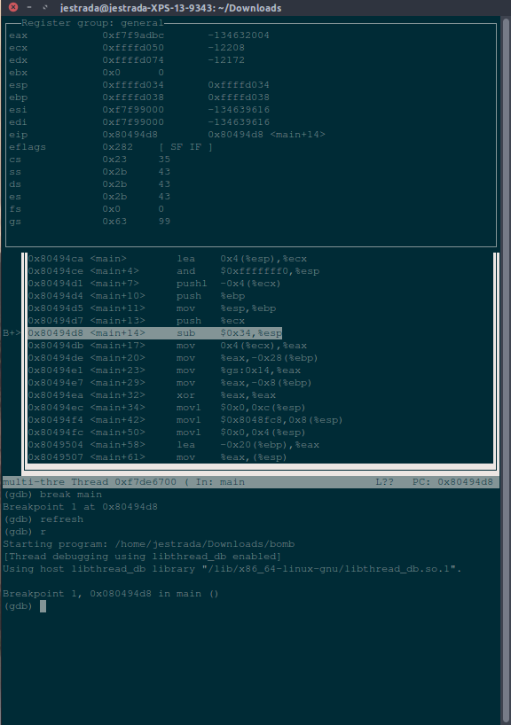

# Useful Links and Tips for the Week

### GDB Tips
- Once you start GDB with your program, you can give your debugger a nice UI by using the layout command. If you write in ``` layout next ``` 4 times you should get the following view in your terminal. It helps if your terminal is somewhat large.   


### Assembly Links
###### LEA vs MOV
https://stackoverflow.com/questions/1658294/whats-the-purpose-of-the-lea-instruction
